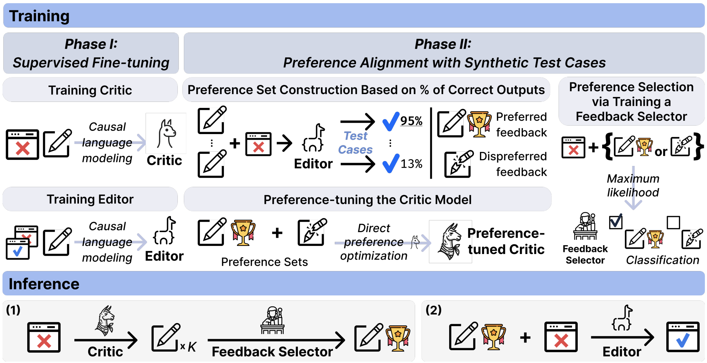

This is the official reposotory of Coffee: Boost Your Code LLMs by Fixing Bugs with Feedback.

We propose an open-source model that specialized to code editing task, showing superior performance to ChaGPT (GPT-3.5-Turbo) and even GPT-4 on HumanEvalFix.

For the dataset and the model checkpoints (including the critic and the editor) please check the link below!

- Dataset: https://huggingface.co/datasets/Anonymous-COFFEE/COFFEE-Dataset
- Model Checkpoints:
  
